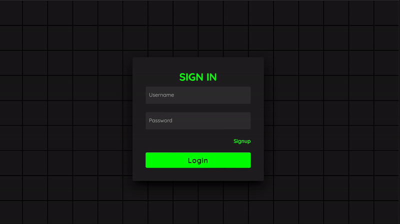

# Secure Messaging Application

Welcome to our Secure Chat Application! This application provides a secure platform for real-time communication between users. It incorporates various security measures to ensure the confidentiality, integrity, and authenticity of messages exchanged within the system.

## How It Works
- Users can register an account with their username, password, email, and full name.
- Upon registration, users are required to set up two-factor authentication (2FA) using one-time passwords (OTP).
- Users can create or join chat rooms using unique room codes.
- Messages sent within chat rooms are encrypted using the Advanced Encryption Standard (AES) algorithm with a shared key.
- Hash-based Message Authentication Codes (HMAC) are used to maintain the integrity of transmitted messages.
- All communication within the system is encrypted using HTTPS protocol with self-signed SSL/TLS certificates, protecting against eavesdropping and Man-in-the-Middle (MITM) attacks.
- The application incorporates error handling mechanisms and access controls to enhance security and stability.

## How to Run the Application

### Step 1: Generate SSL/TLS Key and Certificates
1. Open a terminal or command prompt.
2. Navigate to the directory where the application files are located.
3. Run the command: `python cert_generation.py`
4. Two new files, `key.pem` and `cert.pem`, should appear in the directory.

### Step 2: Install Requirements
1. Ensure you have Python and pip installed on your system.
2. Open a terminal or command prompt.
3. Navigate to the directory where the application files are located.
4. Run the command: `pip install -r requirements.txt`
5. This will install all the required dependencies for the application.

### Step 3: Start the Application
1. Open a terminal or command prompt.
2. Navigate to the directory where the application files are located.
3. Run the command: `python main.py`
4. This will start the application, and you should see output indicating that the server is running.

Enjoy secure communication with our Secure Chat Application!

